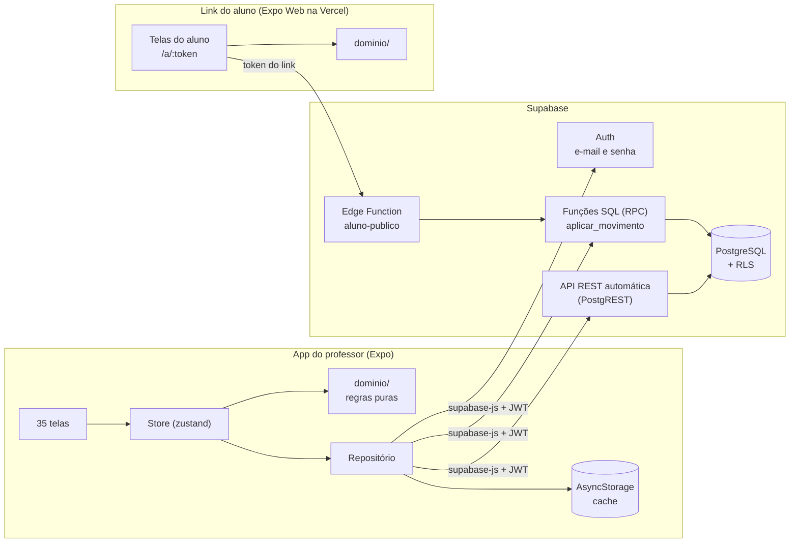
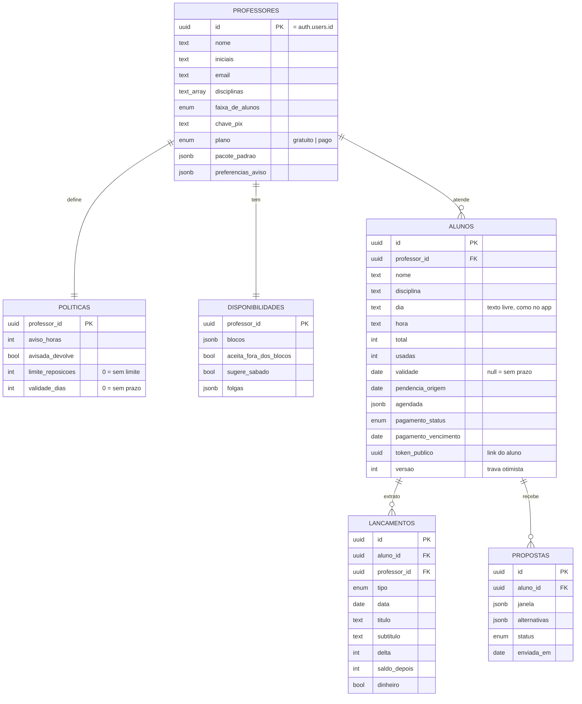
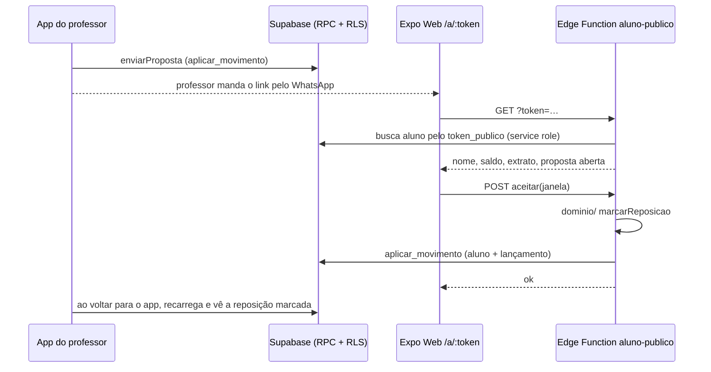

# Plano do backend: Aula em Dia

> **Situação:** planejamento aprovado em 24/09/2026. Nenhuma parte foi construída ainda.
> **Como usar:** cada parte vira uma entrega pequena, que funciona sozinha e tem um critério de "pronto".
> A ordem importa, porque cada parte usa o que a anterior deixou de pé. A Parte 0 é o material da apresentação.

| Parte | O que entrega | Depende de | Esforço estimado |
|---|---|---|---|
| [0](#parte-0-visão-e-decisões) | Visão, arquitetura e decisões justificadas | nada | pronto (este documento) |
| [1](#parte-1-camada-de-repositório-no-app) | O app fala com um "repositório", não mais direto com o AsyncStorage | nada | 1–2 dias |
| [2](#parte-2-projeto-supabase-esquema-e-rls) | Banco modelado, isolado por professor e com dados de demonstração | nada | 1 dia |
| [3](#parte-3-autenticação) | Login e cadastro de verdade | 1, 2 | 1 dia |
| [4](#parte-4-leitura-e-escrita-simples) | O app carrega e salva perfil, configurações e alunos no Supabase | 3 | 2 dias |
| [5](#parte-5-operações-transacionais-rpc) | Aula, reposição, pagamento e pacote gravados de forma atômica | 4 | 2 dias |
| [6](#parte-6-link-público-do-aluno) | O aluno abre um link e vê saldo, extrato e proposta de reposição | 5 | 2–3 dias |
| [7](#parte-7-mensagens-e-lembretes) | WhatsApp de verdade e lembretes automáticos | 4 (wa.me: nenhuma) | 1–2 dias |
| [8](#parte-8-qualidade-e-operação) | Testes de banco, CI, segredos, LGPD e custos | contínua | contínua |

As estimativas supõem uma pessoa trabalhando meio período. São ordem de grandeza, não compromisso.

---

## Parte 0: Visão e decisões

### O problema

Hoje o Aula em Dia funciona **só no aparelho**. O estado inteiro é um JSON no AsyncStorage (chave
`aulaemdia.app.v4`, em [mobile/src/dados/armazenamento.ts](../../mobile/src/dados/armazenamento.ts)),
e o login é simulado ([mobile/src/estado/sessao.ts](../../mobile/src/estado/sessao.ts)). Isso trava quatro
promessas do Envio 01:

1. **Link público do aluno**, com saldo, extrato e proposta de reposição. É o item do MVP que também
   faz a divulgação do produto, e ele só existe se os dados estiverem fora do celular do professor.
2. **Trocar de aparelho sem perder nada.** Hoje, perder o celular é perder a carteira de alunos.
3. **Backup.** O extrato é o registro do dinheiro que o aluno já pagou.
4. **Plano pago por número de alunos.** A monetização precisa de uma conta que o servidor reconheça.

### O que já existe e vai ser aproveitado

- **35 telas prontas** em React Native + Expo, com 303 testes.
- **Regras de negócio puras e testadas** em [mobile/src/dominio/](../../mobile/src/dominio/):
  - `politica.ts`: saldo, faltas e desfechos da aula;
  - `agenda.ts`: o motor de reposição, que é o diferencial do produto;
  - `pacote.ts`, `disponibilidade.ts`, `mensagens.ts`, `validacao.ts`.

  Nenhum desses módulos importa React Native, então rodam em qualquer ambiente TypeScript.
- Uma store única ([mobile/src/estado/dados.ts](../../mobile/src/estado/dados.ts)) com todas as
  ações do app. É a costura onde o backend entra.

### Arquitetura proposta



**Em uma frase:** o app continua calculando as regras com o `dominio/` que já está testado. O
Supabase guarda os dados, isola cada professor com Row Level Security e grava cada movimento numa
transação. O aluno entra por um link com token, sem conta.

### Decisões (registro curto, estilo ADR)

| # | Decisão | Escolha | Alternativas consideradas | Por quê |
|---|---|---|---|---|
| D1 | Linguagem | **TypeScript** no app e nas Edge Functions, **SQL** no banco | Java/Spring, Python/FastAPI, C#/.NET | O domínio já é TS e testado. Qualquer outra linguagem obriga a reescrever e testar tudo de novo, e duas versões da mesma regra acabam divergindo. |
| D2 | Plataforma | **Supabase** (Postgres + Auth + RLS + Edge Functions) | API própria (Node + Fastify + Prisma + Postgres); Firebase (Firestore) | Ver a tabela abaixo. É Postgres puro: se o projeto crescer, os dados vão para uma API própria sem conversão. |
| D3 | Onde mora a regra | **No app** (`dominio/`); o banco só persiste, via RPC transacional | Edge Functions como autoridade; regras reescritas em PL/pgSQL | Mantém uma fonte única e testada. O risco (cliente adulterado) é baixo porque cada professor só escreve nos próprios dados. A RLS e os `CHECK` do banco seguram o pior caso. |
| D4 | Sem internet | **Online com cache local**: o Supabase é a fonte da verdade e o AsyncStorage é cache de leitura | Offline-first com fila de mutações | Offline-first exige fila, reenvio e resolução de conflito; é a parte mais cara de um app. No MVP, abrir sem rede mostra os dados em cache e salvar pede conexão. |
| D5 | Acesso do aluno | **Link com token** (`/a/<token>`) aberto no **Expo Web**, lendo por uma **Edge Function** | Conta de aluno; página web separada | O Envio 01 diz que o aluno não paga e não instala nada. O Expo Web reaproveita as telas de `telas/aluno/`, e o token pode ser revogado. |
| D6 | Autenticação | **Supabase Auth, e-mail e senha** | Magic link, login social | A tela de acesso já pede e-mail e senha, e `validacao.ts` já exige no mínimo 6 caracteres, que é o mesmo padrão do Supabase. |
| D7 | Método de banco | **Migrações SQL versionadas** (`supabase/migrations/`) pela Supabase CLI; nada editado à mão no painel | Editar no painel | O esquema fica revisável no git, reproduzível com `supabase db reset` e defensável na banca. |
| D8 | Contrato de tipos | **Tipos gerados** do banco (`supabase gen types typescript`) | Tipos escritos à mão | Se uma coluna muda, o `typecheck` do app quebra na hora, em vez de quebrar em produção. |
| D9 | Método de construção | **Fatias verticais** (as Partes 1–8), cada uma atrás da variável `EXPO_PUBLIC_BACKEND` | Tudo de uma vez | O app nunca fica quebrado. O modo local continua existindo para demo e para os testes. |

**Supabase × API própria × Firebase**

| Critério | Supabase | API própria (Fastify + Prisma) | Firebase |
|---|---|---|---|
| Tempo até o primeiro login funcionando | horas | dias | horas |
| Banco relacional (extrato como livro-razão, somas do financeiro) | ✅ Postgres | ✅ Postgres | ❌ documentos, somas no cliente |
| Isolamento por professor | ✅ RLS no banco | código em cada rota | regras do Firestore |
| Reaproveitar o `dominio/` em TS | ✅ app + Edge Functions (Deno) | ✅ Node | ✅ Cloud Functions |
| Hospedagem e custo no MVP | plano free (pausa após 7 dias sem uso) | servidor para manter (Render/Railway) | plano free |
| Saída se crescer | Postgres padrão, `pg_dump` | já é própria | migração de NoSQL para SQL |

> **Se a banca perguntar se Supabase é backend de verdade:** o backend é o esquema, as políticas de
> acesso, as funções transacionais e a Edge Function, e tudo isso é código versionado no repositório
> (Partes 2, 5 e 6). O Supabase fornece a infraestrutura (Postgres, autenticação, hospedagem), do mesmo
> jeito que uma API própria usaria um Postgres gerenciado.

### Riscos assumidos

| Risco | Como está coberto | Onde se resolve de vez |
|---|---|---|
| App adulterado grava um saldo errado | RLS limita o estrago aos dados do próprio professor. `CHECK` no banco impede saldo negativo. O extrato só aceita inserção. | Parte 5 (checagens); mover o cálculo para uma Edge Function se virar multi-professor |
| Dois aparelhos editam o mesmo aluno | Coluna `versao` com trava otimista na RPC | Parte 5 |
| Sem rede, não dá para salvar | Mensagem clara no toast; leitura pelo cache | Offline-first, fora do MVP |
| Dados pessoais de alunos, às vezes menores (LGPD) | Mínimo necessário (nome, telefone, e-mail opcional). Exclusão em cascata. | Parte 8 |
| Datas sem ano no app (`dd/mm`, `ANO_DEMO`) | Adaptador na fronteira: o banco guarda `date`, o app continua vendo `dd/mm` | PROXIMOS-PASSOS §3 (datas reais) |

---

## Parte 1: Camada de repositório no app

**Objetivo:** a store para de falar direto com o AsyncStorage e passa a falar com um `Repositorio`.
Nada muda para quem usa o app. Esta parte não depende do Supabase e pode ser feita antes.

**Feita no `SCRUM-17`.** O texto abaixo descreve o que foi construído. Onde isso difere do plano
original, a diferença e a razão estão em [Decisões tomadas na Parte 1](#decisões-tomadas-na-parte-1).

### O que fazer

1. `mobile/src/dados/repositorio.ts` traz a interface:

   ```ts
   export interface Repositorio {
     carregar(): Promise<Gravado | null>;
     /** chamado depois de cada ação; o local grava tudo, o remoto grava só o que mudou */
     registrar(mudanca: Mudanca, estado: Persistido): Promise<void>;
     /** "zerar dados de demonstração": só faz sentido no modo local */
     apagar(): Promise<void>;
   }
   ```

   `Mudanca` é uma união com um caso por ação da store que grava, com o mesmo nome da ação
   (`{ tipo: 'registrarAula', aluno, lancamento, desfecho }`, `{ tipo: 'salvarPoliticas', politicas }`, …).
   São 22 casos, e o typecheck cobra a correspondência nos dois sentidos: ação nova sem caso, ou caso
   sem ação, não compila. O mapa completo está no [Apêndice A](#apêndice-a-ações-da-store--backend).
2. `mobile/src/dados/adaptador.ts` é o repositório local: o `gravar()` e o `carregar()` que moravam em
   `estado/dados.ts`, com o mesmo formato e a mesma chave (`aulaemdia.app.v4`).
3. `estado/dados.ts`: toda ação continua **síncrona e otimista**. Ela calcula com o `dominio/`, faz
   `set()` e devolve o resultado na hora (as telas dependem disso, por exemplo o `EfeitoRegistro`).
   Depois chama `repositorio.registrar(...)` uma vez, sem esperar. O que acontece quando dá erro está
   nas decisões abaixo.
4. A escolha da implementação sai de `EXPO_PUBLIC_BACKEND` (`local` ou `supabase`), com `local` como
   padrão. Um valor sem implementação cai no local. Os testes rodam sempre no local.
5. **Conversor de fronteira** (`mobile/src/dados/conversor.ts`), usado só pelo repositório remoto.
   **Fica para a Parte 4**, quando houver banco para receber. Ele converte entre o formato do app e o
   do banco, para as telas não mudarem, e segue esta tabela:

   | No app hoje | No banco | Regra do conversor |
   |---|---|---|
   | `'30/10'` (dd/mm) | `date` `2026-10-30` | O ano é inferido por `lerDdMm` a partir de hoje (`SCRUM-55`) |
   | `validade: 'sem prazo'` | `validade = null` | `null` ↔ `'sem prazo'` |
   | reais inteiros (`80`) | centavos (`8000`) | × 100 / ÷ 100 |
   | `Lancamento` sem id nem tipo | `lancamentos.id uuid` + `tipo` | Ver a decisão 1, abaixo |
   | `pendencia: { origem, dias }` | `pendencia_origem date` | `dias` passa a ser calculado (`diasEntre(origem, hoje)`) |
   | `pagamento.vence` / `pagamento.venceu` / `dias` | `pagamento_vencimento date` | `dias` calculado |
   | `hoje: boolean` | não é gravado | Derivado do dia fixo e da data de hoje |
   | `agendada`, `proposta.janela` (rótulos como "Sexta, 29/08") | `jsonb` igual ao app | Viram `timestamptz` junto com as datas reais |
   | id `al…` gerado por `Date.now()` | `uuid` | Ver a decisão 2, abaixo |

### Decisões tomadas na Parte 1

**1. `id` e `tipo` do lançamento.** O `Lancamento` do app só tem `d`, `t`, `s`, `delta`, `saldo` e
`dinheiro?`; o banco exige `id` e `tipo`.

- **`tipo` sai da mudança, não do título.** Todo lançamento nasce de uma ação, e a `Mudanca` que o
  leva ao repositório diz qual. É por isso que o caso `registrarAula` carrega o `desfecho`:

  | Ação | `tipo` no banco |
  |---|---|
  | `registrarAula` com `realizada` | `aula` |
  | `registrarAula` com `avisada` | `falta_avisada` |
  | `registrarAula` com `sem_aviso` | `falta_sem_aviso` |
  | `registrarAula` com `cancelada_professor` | `cancelada_professor` |
  | `marcarReposicao`; `responderProposta` aceita ou confirmada | `reposicao` |
  | `receberPagamento`, `registrarPagamentoCom` | `pagamento` |
  | `estenderValidade` | `validade` |
  | `criarPacote`, `renovarPacote`, `criarPacoteCom` | `pacote` |
  | `enviarProposta` | `proposta` |

- **Lançamento que já existia antes do banco** (a semente, e o estado local importado no primeiro
  login, item 4 da Parte 4) não tem mudança de onde tirar o tipo. Para esses vale o título exato:
  "Aula realizada" → `aula`; "Falta avisada" → `falta_avisada`; "Falta sem aviso" → `falta_sem_aviso`;
  "Aula cancelada por você" → `cancelada_professor`; "Reposição marcada" e "Reposição realizada" →
  `reposicao`; "Pagamento recebido" → `pagamento`; "Validade estendida" → `validade`;
  "Pacote de N aulas" → `pacote`; "Proposta de reposição enviada" → `proposta`. O que não casar com
  nenhum vira `legado`, que é para isso que o valor existe no enum. É a mesma tabela que o gerador
  de `seed.sql` usa.
- **`id` não é sintetizado no app.** Quem gera é o banco (`default gen_random_uuid()`). O app nunca
  endereça um lançamento pelo id, porque o extrato só recebe inserção, e por isso `Lancamento` segue
  sem o campo e `dominio/tipos.ts` não muda. A ordem do extrato, que hoje é a posição no array, vira
  `criado_em desc`; na importação em lote o `criado_em` é montado a partir da posição, para dois
  lançamentos do mesmo dia não trocarem de lugar.

**2. O uuid do aluno entra na Parte 4, não aqui.** Antes de existir banco nada consome uuid, e trocar
agora não tiraria trabalho de depois: os ids da semente (`val`, `raf`, …) e os `al…` de quem já usa o
app também não são uuid, então a importação da Parte 4 precisa de um mapa de ids de qualquer jeito.
Fazer aqui só acrescentaria o `expo-crypto` a uma parte cujo papel é abrir a fronteira. Na Parte 4:
`criarAluno` passa a gerar o id com `randomUUID()`, e a importação troca os ids antigos uma única vez,
em `alunos` e nas chaves de `extratos`.

**3. Erro de persistência deixou de ser engolido, mas ainda não chega à tela.** O `gravar()` antigo
tinha um `catch` vazio. Agora o repositório rejeita a promessa e a store decide num lugar só
(`aoFalharNaPersistencia`, em `estado/dados.ts`). No modo local a decisão é manter a tela como está:
a memória é o que a pessoa vê, e recarregar de um disco que acabou de falhar jogaria fora o que ela
fez. O erro aparece no console em desenvolvimento. **Falta** o aviso na tela, porque o texto de
toast mora em `estado/avisos.ts`, que é da camada de apresentação. Com o repositório remoto é nesse
mesmo ponto que entram a recarga e o toast.

**4. Uma gravação por ação, e não duas.** Antes, um movimento gravava o estado duas vezes: uma com o
aluno alterado e outra com o lançamento. Agora a store avisa o repositório uma vez, depois de todos os
`set()`. O conteúdo final do disco é o mesmo; o que deixa de existir é o estado intermediário, com a
aula debitada e sem o lançamento.

**5. Nomes de arquivo.** O card deu o nome `adaptador.ts` ao repositório local, e é lá que o
AsyncStorage ficou. A conversão app ↔ banco, que este plano chamava de adaptador, passa a se chamar
**conversor de fronteira** para os dois não se confundirem.

### Pronto quando

- `npm test` e `npm run typecheck` passam.
- Nenhum arquivo fora de `mobile/src/dados/` importa AsyncStorage para dados (tema e sessão continuam como estão).
- Com `EXPO_PUBLIC_BACKEND=local`, o app se comporta exatamente como hoje.

### Como demonstrar

Mostrar o diagrama: as telas não sabem de onde vêm os dados, e trocar a fonte é trocar uma variável.

---

## Parte 2: Projeto Supabase, esquema e RLS

**Objetivo:** o banco existe, modelado a partir de [mobile/src/dominio/tipos.ts](../../mobile/src/dominio/tipos.ts),
com cada professor enxergando só os próprios dados.

### Preparação

```bash
# na raiz do repositório (precisa de Docker Desktop para o ambiente local)
npx supabase init                    # cria supabase/ (config, migrations, seed)
npx supabase start                   # sobe Postgres, Auth e Studio locais
npx supabase migration new esquema   # supabase/migrations/<data>_esquema.sql
npx supabase db reset                # aplica as migrações + supabase/seed.sql
npx supabase gen types typescript --local > mobile/src/dados/banco.ts
```

Para o projeto na nuvem: criar em supabase.com, depois rodar `npx supabase link --project-ref <ref>`
e `npx supabase db push`.

### Modelo de dados



**Escolhas de modelagem que vale explicar na banca:**

- **O extrato é um livro-razão.** Lançamento só é inserido, nunca editado nem apagado; correção vira
  outro lançamento. É o mesmo princípio de um extrato bancário.
- **`professor_id` repetido nas tabelas filhas.** A RLS vira uma comparação simples, sem join.
- **Configurações em `jsonb`** (blocos, folgas, pacote padrão, preferências). O app sempre as lê e
  grava inteiras e nunca consulta dentro delas.
- **`pendencia.dias` e `pagamento.dias` não são gravados.** Valor derivado de data não fica no
  banco, porque envelhece errado.

### Migração `0001_esquema.sql` (esboço)

```sql
create type faixa_de_alunos  as enum ('1–5', '6–15', '16+');
create type plano            as enum ('gratuito', 'pago');
create type status_pagamento as enum ('pago', 'aberto', 'atraso', 'sem');
create type status_proposta  as enum ('enviada', 'aceita', 'recusada', 'confirmadaPeloProfessor');
create type tipo_lancamento  as enum (
  'aula', 'falta_avisada', 'falta_sem_aviso', 'cancelada_professor',
  'reposicao', 'pagamento', 'pacote', 'validade', 'proposta', 'legado'
);

create table public.professores (
  id                 uuid primary key references auth.users on delete cascade,
  nome               text not null default '',
  iniciais           text not null default '',
  email              text not null,
  disciplinas        text[] not null default '{}',
  faixa_de_alunos    faixa_de_alunos,
  chave_pix          text,
  plano              plano not null default 'gratuito',
  pacote_padrao      jsonb,
  preferencias_aviso jsonb,
  criado_em          timestamptz not null default now()
);

create table public.politicas (
  professor_id      uuid primary key references public.professores on delete cascade,
  aviso_horas       int  not null default 24 check (aviso_horas >= 0),
  avisada_devolve   bool not null default true,
  limite_reposicoes int  not null default 3  check (limite_reposicoes >= 0),
  validade_dias     int  not null default 60 check (validade_dias >= 0)
);

create table public.disponibilidades (
  professor_id           uuid primary key references public.professores on delete cascade,
  blocos                 jsonb not null default '[]',
  aceita_fora_dos_blocos bool  not null default false,
  sugere_sabado          bool  not null default false,
  folgas                 jsonb not null default '[]'
);

create table public.alunos (
  id                      uuid primary key default gen_random_uuid(),
  professor_id            uuid not null default auth.uid() references public.professores on delete cascade,
  nome                    text not null,
  disciplina              text not null,
  dia                     text not null,
  hora                    text not null,
  telefone                text,
  email                   text,
  -- pacote
  total                   int  not null default 0 check (total >= 0),
  usadas                  int  not null default 0 check (usadas >= 0),
  validade                date,
  validade_estendida      bool not null default false,
  sem_pacote              bool not null default false,
  encerrado               date,
  valor_por_aula_centavos int  check (valor_por_aula_centavos >= 0),
  -- reposição
  reposicoes              int  not null default 0,
  pendencia_origem        date,
  agendada                jsonb,
  disponibilidade         jsonb,
  -- cobrança
  pausado                 bool not null default false,
  lembretes               int  not null default 0,
  ultimo_lembrete         date,
  atrasos_historicos      int  not null default 0,
  pagamento_status        status_pagamento not null default 'sem',
  pagamento_em            date,
  pagamento_meio          text,
  pagamento_vencimento    date,
  -- controle
  arquivado               bool not null default false,
  token_publico           uuid not null unique default gen_random_uuid(),
  versao                  int  not null default 0,
  criado_em               timestamptz not null default now(),
  constraint saldo_nao_negativo check (usadas <= total)
);

create table public.lancamentos (
  id            uuid primary key default gen_random_uuid(),
  aluno_id      uuid not null references public.alunos on delete cascade,
  professor_id  uuid not null references public.professores on delete cascade,
  tipo          tipo_lancamento not null,
  data          date not null,
  titulo        text not null,
  subtitulo     text not null default '',
  delta         int  not null,
  saldo_depois  int  not null check (saldo_depois >= 0),
  dinheiro      bool not null default false,
  criado_em     timestamptz not null default now()
);
create index lancamentos_do_aluno on public.lancamentos (aluno_id, criado_em desc);

create table public.propostas (
  id            uuid primary key default gen_random_uuid(),
  aluno_id      uuid not null references public.alunos on delete cascade,
  professor_id  uuid not null references public.professores on delete cascade,
  janela        jsonb not null,
  alternativas  jsonb not null default '[]',
  status        status_proposta not null default 'enviada',
  enviada_em    date not null,
  respondida_em timestamptz
);
-- no máximo uma proposta aberta por aluno, como no app
create unique index uma_proposta_aberta on public.propostas (aluno_id) where status = 'enviada';
```

> O `check (usadas <= total)` reflete o que o domínio já garante: `registrarAula` em `politica.ts`
> nunca deixa o saldo abaixo de zero. Se o banco recusar um movimento por isso, é bug no app.

### Migração `0002_rls.sql` (esboço)

```sql
alter table public.professores      enable row level security;
alter table public.politicas        enable row level security;
alter table public.disponibilidades enable row level security;
alter table public.alunos           enable row level security;
alter table public.lancamentos      enable row level security;
alter table public.propostas        enable row level security;

create policy "o próprio perfil" on public.professores
  for all using (id = (select auth.uid())) with check (id = (select auth.uid()));

-- mesmo padrão para politicas, disponibilidades, alunos e propostas
create policy "os próprios alunos" on public.alunos
  for all using (professor_id = (select auth.uid()))
  with check (professor_id = (select auth.uid()));

-- extrato: lê e insere, nunca edita nem apaga (sem policy de update/delete)
create policy "lê o próprio extrato" on public.lancamentos
  for select using (professor_id = (select auth.uid()));
create policy "insere no próprio extrato" on public.lancamentos
  for insert with check (
    professor_id = (select auth.uid())
    and exists (select 1 from public.alunos a
                where a.id = aluno_id and a.professor_id = (select auth.uid()))
  );
```

### Dados de demonstração

`supabase/seed.sql` é gerado a partir de [data/seed.json](../../data/seed.json) por um script
(`scripts/gerar-seed-sql.mjs`), com os 4 alunos e seus extratos sob um professor de teste (definido
logo abaixo). Não é escrito à mão: o seed.json continua sendo a fonte, como diz o CLAUDE.md.

### Professor de teste do seed

Decidido no `SCRUM-50`. **Somente banco local, nunca produção.**

```
uuid  00000000-0000-4000-8000-000000000001
email professor@exemplo.test
senha aulaemdia-local
```

O uuid é um v4 válido e fácil de reconhecer numa consulta, o domínio `.test` é reservado e nunca
entrega e-mail, e a senha não é usada em nenhum outro lugar. Nenhuma chave do projeto entra no seed:
ele só precisa destes três valores.

**Por que existe.** O seed roda sem contexto de autenticação, então `auth.uid()` devolve `null`.
Como `alunos.professor_id` é `not null default auth.uid()`, inserir um aluno sem informar o
professor falha (`null value in column "professor_id" ... violates not-null constraint`). Informar o
professor exige uma linha em `professores`, que por sua vez exige uma linha em `auth.users`, e o
trigger que cria `professores` a partir de `auth.users` só chega na Parte 3. Por isso o seed insere
as duas explicitamente, com uuid fixo, sem depender do default nem do trigger.

**O SQL testado.** É o primeiro bloco do `seed.sql`, antes de qualquer aluno:

```sql
-- Professor de teste do Aula em Dia. SOMENTE banco local, nunca produção.
begin;

insert into auth.users (
  instance_id, id, aud, role, email, encrypted_password,
  email_confirmed_at, raw_app_meta_data, raw_user_meta_data,
  created_at, updated_at,
  confirmation_token, email_change, email_change_token_new, recovery_token
) values (
  '00000000-0000-0000-0000-000000000000',
  '00000000-0000-4000-8000-000000000001',
  'authenticated', 'authenticated',
  'professor@exemplo.test',
  extensions.crypt('aulaemdia-local', extensions.gen_salt('bf')),
  now(),
  '{"provider":"email","providers":["email"]}', '{}',
  now(), now(),
  '', '', '', ''
)
on conflict (id) do nothing;

insert into auth.identities (
  id, user_id, provider_id, provider, identity_data,
  last_sign_in_at, created_at, updated_at
) values (
  '00000000-0000-4000-8000-000000000001',
  '00000000-0000-4000-8000-000000000001',
  '00000000-0000-4000-8000-000000000001',
  'email',
  jsonb_build_object(
    'sub',   '00000000-0000-4000-8000-000000000001',
    'email', 'professor@exemplo.test',
    'email_verified', true
  ),
  now(), now(), now()
)
on conflict (provider_id, provider) do nothing;

insert into public.professores (id, email)
values ('00000000-0000-4000-8000-000000000001', 'professor@exemplo.test')
on conflict (id) do nothing;

commit;
```

O que cada detalhe segura, conferido no banco e não presumido:

- **Os quatro tokens como `''`.** Com eles em `null`, o login devolve 500 (`Database error querying
  schema`), porque o serviço de Auth não converte `null` em texto ao ler `confirmation_token`.
- **`extensions.crypt`.** O `pgcrypto` mora no schema `extensions`; sem o prefixo a função não é
  encontrada.
- **`auth.identities`.** Nesta versão o login por senha funciona mesmo sem a linha, mas ela fica: é
  o que o `signUp` cria, e o usuário de teste deve ter a mesma forma de um usuário real. O `id` é o
  uuid fixo, e o `on conflict` aponta para `(provider_id, provider)`, que é o índice único da
  tabela. As colunas `email` de `auth.identities` e `confirmed_at` de `auth.users` são geradas e não
  entram no insert.
- **`professores (id, email)`.** `email` é a única coluna `not null` sem default. Nome, iniciais e
  disciplinas vêm do gerador, na `SCRUM-18`.

**Onde foi testado.** Em 07/10/2026, com PostgreSQL 17.11, Supabase CLI 2.120.0 e Auth (GoTrue)
v2.197.0, só no ambiente local. A forma de `auth.users` e `auth.identities` muda entre versões:
ao subir a versão do CLI, rodar este roteiro de novo.

1. `npx supabase db reset`, depois o bloco duas vezes seguidas pelo `psql`, como `postgres` e com
   `ON_ERROR_STOP=1`. A primeira insere uma linha em cada tabela; a segunda não insere nenhuma e
   também sai sem erro.
2. Um aluno mínimo (`professor_id`, `nome`, `disciplina`, `dia`, `hora`) entra com este
   `professor_id`, dentro de uma transação desfeita em seguida.
3. `POST /auth/v1/token?grant_type=password` com o e-mail e a senha devolve `access_token`. Com esse
   token, `select` em `professores` devolve só a linha do professor de teste; sem ele, devolve vazio.

**Interação com a Parte 3.** Quando a `0003_novo_professor.sql` existir, o insert em `auth.users`
dispara o trigger, que cria sozinho as linhas de `professores`, `politicas` e `disponibilidades`.
Fica valendo a **idempotência**: o insert explícito em `professores` usa `on conflict (id) do
nothing` e o bloco roda igual com ou sem o trigger. Foi testado com o trigger deste plano instalado
só no banco local: as duas execuções passam e sobra uma linha em cada tabela. Sem o `on conflict`, a
mesma execução para em `duplicate key value violates unique constraint "professores_pkey"`.

A alternativa era o seed rodar antes de o trigger existir. Foi recusada porque o `db reset` aplica
todas as migrações e só depois o seed: assim que a `0003` entrar, o seed sempre encontra o trigger.
Depender da ordem faria o seed quebrar no primeiro `db reset` da Parte 3.

Duas consequências para quem escrever o resto do seed:

- `do nothing` não sobrescreve. Com o trigger no lugar, a linha de `professores` já chega criada
  só com `id` e `email`; o perfil (nome, iniciais, disciplinas, faixa) tem de entrar por `on
  conflict (id) do update` ou por um `update` depois do bloco.
- O mesmo vale para `politicas` e `disponibilidades`: o trigger as cria com os padrões, então os
  inserts do seed precisam de `on conflict (professor_id) do update`.

O `seed.sql` em si é escrito na `SCRUM-18`, usando este bloco.

### Pronto quando

- `npx supabase db reset` sobe tudo sem erro.
- No Studio, logado como o professor A, não aparece nenhum aluno do professor B. Testar com dois usuários criados no painel de Auth.
- `mobile/src/dados/banco.ts` foi gerado e compila.

### Como demonstrar

Abrir o Studio e mostrar as tabelas. No SQL Editor, rodar `select * from alunos` como dois usuários
diferentes e mostrar resultados diferentes: é a RLS funcionando.

---

## Parte 3: Autenticação

**Objetivo:** criar conta e entrar de verdade. As fases da entrada (`carregando → entrada → onboarding → app`)
continuam as mesmas.

### O que fazer

1. Instalar `@supabase/supabase-js` e criar `mobile/src/dados/supabase.ts`:

   ```ts
   import AsyncStorage from '@react-native-async-storage/async-storage';
   import { createClient } from '@supabase/supabase-js';
   import type { Database } from './banco';

   export const supabase = createClient<Database>(
     process.env.EXPO_PUBLIC_SUPABASE_URL!,
     process.env.EXPO_PUBLIC_SUPABASE_PUBLISHABLE_KEY!, // chave pública; nunca a service role
     { auth: { storage: AsyncStorage, autoRefreshToken: true, persistSession: true, detectSessionInUrl: false } },
   );
   ```

   Antes de instalar, conferir no guia oficial "Supabase + Expo" se ainda é preciso algum polyfill
   (`react-native-url-polyfill`) com o React Native 0.86.
2. `estado/sessao.ts`:
   - "Entrar" chama `signInWithPassword`.
   - "Criar conta" chama `signUp` e abre o onboarding.
   - "Sair" chama `signOut`.
   - Erros do Supabase viram as mensagens de `validacao.ts` (`ERRO`), em pt-BR.
3. Migração `0003_novo_professor.sql`: um trigger em `auth.users` cria as linhas de `professores`,
   `politicas` e `disponibilidades` com os padrões:

   ```sql
   create function public.criar_professor() returns trigger
   language plpgsql security definer set search_path = '' as $$
   begin
     insert into public.professores (id, email) values (new.id, new.email);
     insert into public.politicas (professor_id) values (new.id);
     insert into public.disponibilidades (professor_id) values (new.id);
     return new;
   end $$;

   create trigger ao_criar_usuario after insert on auth.users
     for each row execute function public.criar_professor();
   ```
4. Confirmação de e-mail: desligar no MVP (Auth → Providers → Email) para o cadastro seguir direto
   para o onboarding. Religar antes de publicar.

### Pronto quando

- Criar conta no celular faz a linha aparecer em `professores` no painel.
- Fechar e abrir o app mantém a pessoa logada.
- "Sair" volta para a tela de acesso.

---

## Parte 4: Leitura e escrita simples

**Objetivo:** com `EXPO_PUBLIC_BACKEND=supabase`, o app carrega tudo do banco e grava as ações que
não mexem em saldo.

### O que fazer

1. `RepositorioSupabase.carregar()`: seis `select` em paralelo (professor, políticas,
   disponibilidade, alunos, lançamentos, propostas abertas). O conversor de fronteira monta o mesmo
   `Persistido` que a store já espera. O resultado também vai para o AsyncStorage como cache, e na
   próxima abertura o app mostra o cache primeiro e atualiza em seguida.
2. Ações de gravação direta (sem lançamento no extrato):

   | Ação da store | Operação |
   |---|---|
   | `salvarPerfil`, `salvarPacotePadrao`, `salvarPreferenciasDeAviso` | `update professores` |
   | `salvarPoliticas` | `update politicas` |
   | `salvarDisponibilidade` | `update disponibilidades` |
   | `criarAluno` | `insert alunos` (id gerado no app) |
   | `atualizarAluno`, `arquivarAluno`, `alternarPausa`, `salvarDisponibilidadeDoAluno` | `update alunos` |
   | `enviarLembrete`, `cobrarTodosEmAtraso` | `update alunos` (um ou vários) |

3. O onboarding (`telas/entrada/Perfil.tsx`, `PoliticaInicial.tsx`, `Disponibilidade.tsx`,
   `PrimeiroAluno.tsx`) passa a gravar no banco pelo mesmo caminho, sem mudança nas telas.
4. **Importar os dados locais.** No primeiro login de um aparelho que já tem dados no AsyncStorage
   (`aulaemdia.app.v4`), perguntar "Levar seus alunos para a conta?" e enviar tudo. Os lançamentos
   antigos entram com `tipo = 'legado'`.
5. Falha de rede: o toast existente mostra "Não deu para salvar. Confira a conexão e tente de novo." e
   a store recarrega do banco.

### Pronto quando

- Editar a política num aparelho e abrir o app em outro (ou no Expo Web) mostra a mudança.
- Com o avião ligado, o app abre pelo cache e salvar mostra o aviso.

---

## Parte 5: Operações transacionais (RPC)

**Objetivo:** tudo que mexe no saldo ou no extrato grava **aluno + lançamento juntos**, ou nada. O
supabase-js não abre transação pelo cliente, então a transação mora numa função SQL.

### A função

```sql
create function public.aplicar_movimento(
  p_aluno      jsonb,             -- o aluno inteiro, já calculado pelo dominio/ e convertido pelo conversor
  p_versao     int,               -- a versão que o app leu
  p_lancamento jsonb default null,
  p_proposta   jsonb default null
) returns int                     -- a nova versão
language plpgsql
security invoker                  -- a RLS continua valendo dentro da função
set search_path = '' as $$
declare
  v_id   uuid := (p_aluno->>'id')::uuid;
  v_nova int;
begin
  update public.alunos a set
    total = n.total, usadas = n.usadas, validade = n.validade,
    validade_estendida = n.validade_estendida, sem_pacote = n.sem_pacote,
    reposicoes = n.reposicoes, pendencia_origem = n.pendencia_origem, agendada = n.agendada,
    pausado = n.pausado, pagamento_status = n.pagamento_status, pagamento_em = n.pagamento_em,
    pagamento_meio = n.pagamento_meio, pagamento_vencimento = n.pagamento_vencimento,
    valor_por_aula_centavos = n.valor_por_aula_centavos,
    versao = a.versao + 1
  from jsonb_populate_record(null::public.alunos, p_aluno) n
  where a.id = v_id and a.versao = p_versao
  returning a.versao into v_nova;

  if v_nova is null then
    raise exception 'conflito_de_versao'
      using hint = 'Este aluno mudou em outro aparelho. Recarregue.';
  end if;

  if p_lancamento is not null then
    insert into public.lancamentos
      (aluno_id, professor_id, tipo, data, titulo, subtitulo, delta, saldo_depois, dinheiro)
    select v_id, a.professor_id, l.tipo, l.data, l.titulo, l.subtitulo, l.delta, l.saldo_depois, l.dinheiro
    from jsonb_populate_record(null::public.lancamentos, p_lancamento) l, public.alunos a
    where a.id = v_id;
  end if;

  if p_proposta is not null then
    -- fecha a proposta aberta, se houver, e grava a nova (ou só a resposta)
    -- detalhado na implementação
    null;
  end if;

  return v_nova;
end $$;
```

**Por que a coluna `versao`:** se o professor registra a aula no celular e, ao mesmo tempo, o aluno
aceita a reposição pelo link, a segunda gravação encontra a versão mudada e falha em vez de
sobrescrever. O app recarrega e a pessoa refaz com os dados certos. Isso é a **trava otimista**. O
repositório guarda a versão de cada aluno num mapa interno, então o `dominio/` não precisa saber dela.

### Ações que passam pela RPC

`registrarAula`, `marcarReposicao`, `receberPagamento`, `registrarPagamentoCom`, `estenderValidade`,
`criarPacote`, `renovarPacote`, `criarPacoteCom`, `enviarProposta` e `responderProposta` (do lado do
professor). Em todas, o cálculo continua em `politica.ts` ou `pacote.ts` e a RPC só grava.

### Regra do plano gratuito (opcional nesta parte)

O Envio 01 limita o plano gratuito por número de alunos. Um trigger `before insert on alunos` recusa
o aluno N+1 quando `plano = 'gratuito'`. O **limite ainda precisa ser decidido** com o time.

### Pronto quando

- Registrar aula, marcar reposição, receber pagamento e renovar pacote aparecem no Studio: o aluno
  e o lançamento mudam juntos.
- Um teste força a falha do `insert` e confirma que o aluno não mudou (rollback).
- Editar o mesmo aluno em dois aparelhos dá conflito e recarrega, sem perder dado.

---

## Parte 6: Link público do aluno

**Objetivo:** o professor copia um link e o aluno, sem conta e sem instalar nada, vê saldo, extrato e
a proposta de reposição, e responde a ela.

### Fluxo



### O que fazer

1. **Edge Function** `supabase/functions/aluno-publico/` (Deno, TypeScript):
   - `GET ?token=`: devolve só o necessário (primeiro nome, saldo, validade, extrato e proposta
     aberta). Nunca devolve telefone, e-mail nem dados do professor além do nome.
   - `POST {token, acao: 'responder', status, janela?}` e `POST {token, acao: 'disponibilidade', blocos}`.
   - Usa a **service role** (só existe no servidor) e sempre filtra pelo `token_publico`.
   - Reaproveita o `dominio/`. Os imports do domínio são sem extensão (`./tipos`) e o Deno exige
     `.ts`, então gerar um bundle com esbuild (`npm run bundle:dominio` →
     `supabase/functions/_shared/dominio.js`) em vez de copiar o código.
2. **Expo Web:**
   - No `App.tsx`, se `window.location.pathname` começa com `/a/`, a raiz vira um `AppDoAluno`, que
     usa um repositório público (lê e escreve pela Edge Function) e renderiza as telas de
     `telas/aluno/` já existentes: `VisaoDoAluno`, saldo, proposta e disponibilidade.
   - Publicar com `npx expo export --platform web` e mandar para a Vercel, com uma rewrite de
     `/a/*` para `index.html`.
3. **No app do professor:**
   - Botão "Copiar link do aluno" na ficha.
   - "Gerar novo link" troca o `token_publico`, e o link antigo para de funcionar.
   - O app recarrega ao voltar para o primeiro plano (`AppState`) para ver as respostas.
   - Supabase Realtime fica para depois.
4. Proteção básica: token é UUID v4 (impossível de adivinhar na prática); limite de requisições por
   IP na Edge Function; o link não aparece em buscadores (`noindex`).

### Pronto quando

- O link aberto no navegador do celular mostra o saldo certo.
- Aceitar a proposta no link faz a reposição aparecer marcada no app do professor, com o lançamento
  no extrato.
- Gerar um novo link invalida o anterior.

---

## Parte 7: Mensagens e lembretes

**Objetivo:** a mensagem sai de verdade, e os lembretes deixam de ser só uma preferência salva.

1. **WhatsApp por link, sem backend.** Pode ser feito antes de todas as outras partes. Em
   `mobile/src/componentes/PreviaDeMensagem.tsx`, trocar o `Clipboard` por
   `Linking.openURL('https://wa.me/55' + telefone + '?text=' + encodeURIComponent(texto))`. O texto
   já sai pronto de `mensagens.ts` (PROXIMOS-PASSOS §5). Quando a Parte 6 existir, a mensagem de
   reposição leva o link do aluno.
2. **Lembretes automáticos**, depois:
   - `pg_cron` roda todo dia às 7h e chama uma Edge Function `avisos-do-dia`.
   - A função lista, por professor, as aulas do dia, os saldos baixos (`SALDO_BAIXO` de
     `politica.ts`), as reposições pendentes e os pagamentos vencendo, respeitando `preferencias_aviso`.
   - Envia pelo Expo Push. O app grava o token de push em `professores`.
   - Push exige um **development build**: desde o SDK 53, o Expo Go no Android não recebe push
     remoto. Isso casa com PROXIMOS-PASSOS §7.

### Pronto quando

- Tocar em "Enviar" abre o WhatsApp com a mensagem e o telefone certos.
- (Lembretes) O professor de teste recebe o push do dia com os números do Studio.

---

## Parte 8: Qualidade e operação

Esta parte não tem fim: cada parte anterior deixa aqui o que precisa.

- **Testes:**
  - Os testes do `dominio/` ficam como estão; são a garantia das regras.
  - Novos testes de integração com Jest (`mobile/src/dados/__tests__/`) rodam contra o Supabase local:
    - RLS: o professor B não lê nem grava nada do professor A;
    - `aplicar_movimento` faz rollback quando o lançamento falha e dá conflito com versão velha;
    - a Edge Function só devolve o aluno do token.
  - O conversor de fronteira tem testes de ida e volta: app → banco → app devolve o mesmo objeto.
- **CI (GitHub Actions):** `npm test` + `npm run typecheck` a cada push. Com a Parte 2, entram também
  `supabase db lint` e os testes de integração (a Supabase CLI roda no Actions com Docker).
- **Segredos:**
  - No app só vão `EXPO_PUBLIC_SUPABASE_URL` e a chave pública. Tudo que começa com `EXPO_PUBLIC_`
    vai para dentro do app e deve ser tratado como público.
  - A service role fica só nos segredos das Edge Functions (`supabase secrets set`).
  - `.env` no `.gitignore`, com um `.env.exemplo` versionado.
- **LGPD:**
  - Coletar só o necessário.
  - "Excluir minha conta" em Ajustes apaga o usuário no Auth, e o `on delete cascade` leva todo o resto.
  - "Exportar meus dados" gera um JSON.
  - Política de privacidade antes de publicar.
- **Custos e limites:**
  - O plano free do Supabase cobre o MVP com folga (banco de 500 MB, 50 mil usuários ativos no Auth),
    mas **pausa o projeto após 7 dias sem uso**. Antes da banca ou de um teste com usuários, abrir o
    painel ou fazer uma requisição.
  - Conferir os números atuais no site do Supabase antes de citar.
- **Backup:** o plano free não tem backup automático com restauração no tempo. Um `pg_dump` semanal
  pelo Actions resolve no MVP.

---

## Apêndice A: Ações da store → backend

Todas as ações de [mobile/src/estado/dados.ts](../../mobile/src/estado/dados.ts):

| Ação | Parte | Caminho no backend |
|---|---|---|
| `carregar` | 4 | 6 `select` em paralelo + cache |
| `zerar` | — | só no modo local (demonstração) |
| `alunoPor` | — | leitura em memória |
| `registrarAula` | 5 | RPC `aplicar_movimento` (aluno + lançamento) |
| `marcarReposicao` | 5 | RPC |
| `receberPagamento`, `registrarPagamentoCom` | 5 | RPC (lançamento com `dinheiro = true`) |
| `estenderValidade` | 5 | RPC |
| `criarPacote`, `renovarPacote`, `criarPacoteCom` | 5 | RPC |
| `enviarProposta` | 5 | RPC (aluno + lançamento + proposta) |
| `responderProposta` | 5 / 6 | RPC pelo professor; Edge Function pelo aluno |
| `alternarPausa` | 4 | `update alunos` |
| `enviarLembrete`, `cobrarTodosEmAtraso` | 4 | `update alunos` |
| `criarAluno` | 4 | `insert alunos` |
| `atualizarAluno`, `arquivarAluno` | 4 | `update alunos` |
| `salvarDisponibilidadeDoAluno` | 4 / 6 | `update alunos` pelo professor; Edge Function pelo aluno |
| `salvarPerfil`, `salvarPacotePadrao`, `salvarPreferenciasDeAviso` | 4 | `update professores` |
| `salvarPoliticas` | 4 | `update politicas` |
| `salvarDisponibilidade` | 4 | `update disponibilidades` |

## Apêndice B: Linguagens e métodos, em resumo

- **Linguagens:** TypeScript (app, conversor de fronteira, Edge Functions) e SQL / PL/pgSQL (esquema, RLS, RPC,
  triggers). Nada além disso.
- **Métodos:**
  - Migrações versionadas e reproduzíveis.
  - Tipos gerados a partir do banco.
  - Regras testadas em funções puras, como já é hoje.
  - Fatias verticais atrás de uma variável de ambiente.
  - Decisões registradas em tabela (Parte 0).
  - Um commit por parte, com o "Pronto quando" conferido.
- **Ferramentas:**
  - Supabase CLI e Docker Desktop, para o ambiente local;
  - Studio, o painel do Supabase;
  - Vercel, para o link do aluno;
  - GitHub Actions, para o CI.

## Apêndice C: Perguntas prováveis da banca

**"Por que as regras rodam no app e não no servidor?"**
Porque já estão escritas e testadas em TypeScript puro, e duplicar a regra é a maior fonte de bug. O
servidor protege o que precisa ser protegido:
- isolamento por professor (RLS);
- atomicidade (RPC);
- invariantes (`CHECK`);
- extrato imutável.

Se o produto virar multi-professor, o mesmo `dominio/` passa para uma Edge Function sem reescrita.

**"E se o professor estiver sem internet?"**
O app abre com os dados em cache e avisa ao tentar salvar. Offline-first foi avaliado e adiado por
custo (Decisão D4).

**"Como o aluno acessa sem senha? Isso é seguro?"**
Pelo link com um token aleatório de 122 bits, o mesmo modelo do "qualquer pessoa com o link" do Google
Drive. O link mostra só o saldo do próprio aluno, nunca dados de contato, e o professor pode revogá-lo
a qualquer momento.

**"Por que Postgres e não Firebase?"**
O centro do produto é um extrato financeiro, que precisa de somas, integridade e transação. Isso é
banco relacional.

**"Supabase não prende vocês?"**
Não: é Postgres padrão. O esquema e as funções estão no repositório, e `pg_dump` leva tudo para
qualquer Postgres.

## Apêndice D: Roteiro de 5 minutos para a apresentação

1. **O problema (30 s):** tudo vive no celular. Sem backend não há link do aluno, troca de aparelho
   nem backup.
2. **O que já está pronto (45 s):** 35 telas, 303 testes e o domínio puro com o motor de reposição.
3. **Arquitetura (1 min):** o diagrama da Parte 0 e a frase-resumo.
4. **Decisões (1 min):** TypeScript + SQL, Supabase, regra no app com RPC transacional, link com token.
   Mostrar a tabela Supabase × API própria × Firebase.
5. **Modelo de dados (1 min):** o diagrama ER, o extrato como livro-razão e a RLS isolando professores.
6. **Plano em partes (45 s):** a tabela do topo, com cada parte tendo o seu "pronto quando".
7. **Próximo passo (15 s):** Partes 1 e 2 primeiro, porque não dependem uma da outra.

**Se der tempo antes da banca:** criar o projeto no supabase.com e colar as migrações `0001` e `0002`
no SQL Editor (cerca de 30 minutos). Na apresentação, mostrar as tabelas no Studio e a RLS
funcionando: vale mais que qualquer slide.
